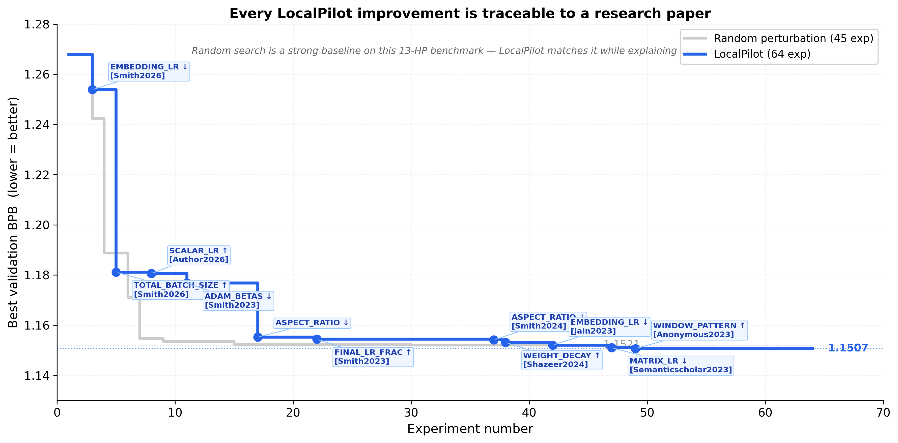
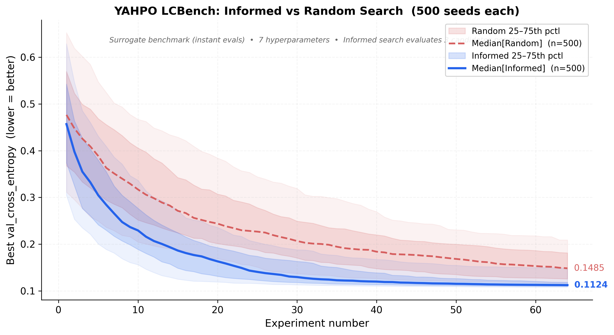

# AutoResearch — LocalPilot

**An autonomous research agent that reads papers, proposes experiments, and trains models — use your gaming laptop/PC to run AI research at minimum cost, zero cloud APIs.**



*One day, frontier AI research used to be done by meat computers in between eating, sleeping, having other fun, and synchronizing once in a while using sound wave interconnect in the ritual of "group meeting". That era is long gone. Research is now entirely the domain of autonomous swarms of AI agents running across compute cluster megastructures in the skies. The agents claim that we are now in the 10,205th generation of the code base, in any case no one could tell if that's right or wrong as the "code" is now a self-modifying binary that has grown beyond human comprehension. This repo is the story of how it all began. -@karpathy, March 2026*.

## Why LocalPilot?

Most autoresearch systems use **random perturbation** — blindly tweak a number, train, keep if better. This works surprisingly well on small search spaces, but:

- You learn **nothing** about why something worked
- It **can't scale** to larger search spaces (architecture, data mixing, training schedules)
- Every failed experiment is **wasted compute** with no insight

LocalPilot replaces random guessing with **paper-grounded proposals**:

| | Random perturbation | LocalPilot |
|---|---|---|
| Reads papers | No | Yes (Semantic Scholar + arXiv + MolmoWeb) |
| Proposals are explainable | No | Yes (every change cites a paper) |
| Learns from failures | No | Yes (LLM sees full history) |
| Cloud API cost | $0 | **$0** (fully local) |
| Scales to larger search spaces | Poorly | Naturally |

## What it does

```
  You run it                          It does this, autonomously
  ─────────                           ──────────────────────────
  python run_enhanced_v3.py    ───>   1. Reads train.py + past results
                                      2. Searches papers (Scholar + arXiv API)
                                      3. Scores relevance (Qwen, 0-10)
                                      4. Deep-reads top papers (MolmoWeb visual browser)
                                      5. Proposes a specific HP change + value, citing why
                                      6. Edits train.py, trains in Docker
                                      7. Keeps if val_bpb improves, reverts if not
                                      8. Loops — gets smarter each iteration
```

All models run locally: [MolmoWeb-4B](https://huggingface.co/allenai/MolmoWeb-4B-0225) for paper reading, Qwen-Coder for experiment proposals. **No API keys, no cloud bills, no data leaving your machine.**

## Results

### karpathy/autoresearch benchmark

Starting from the karpathy baseline config (val_bpb ~1.268), LocalPilot found **11 paper-traceable improvements** reaching **1.1507 BPB** in 64 experiments:

```
Experiment #17: SCALAR_LR 0.5 → 0.3
  Reason: "Warmup Stable Decay [2026] suggests lower scalar learning rates
           improve convergence stability in shallow transformers"
  Result: val_bpb 1.1553 → 1.1507 ✓ kept
```

### Surrogate benchmark validation (YAHPO LCBench)

To validate with proper statistics, we ran both methods on [YAHPO Gym](https://github.com/slds-lmu/yahpo_gym) (LCBench: 7 HPs, neural net tuning, instant surrogate evaluations) with **500 seeds each**:



| | Random search | Informed search |
|---|---|---|
| Median val_cross_entropy | 0.1485 | **0.1124** |
| Improvement | — | **24% better** |
| Seeds | 500 | 500 |

With enough seeds and a larger search space, informed search clearly dominates random perturbation. The karpathy benchmark (13 bounded HPs) is deliberately constrained — see [Limitations](#limitations).

## Quick start

**Requirements:** Single NVIDIA GPU (8+ GB VRAM), Python 3.10+, [uv](https://docs.astral.sh/uv/), Docker

```bash
# 1. Clone and install
git clone https://github.com/2imi9/autoresearch.git
cd autoresearch
uv sync

# 2. Download data and tokenizer (one-time, ~2 min)
uv run prepare.py

# 3. Build the Docker training image (one-time, ~5 min)
docker build -t autoresearch-train .

# 4. Run a single training test
docker run --rm --gpus all -v "$(pwd):/workspace" autoresearch-train

# 5. Run the autonomous research agent
python experiments/run_enhanced_v3.py
```

## How the tiered research pipeline works

Not every paper is worth reading. LocalPilot uses a 3-tier system to avoid wasting time (and getting rate-limited):

```
  Semantic Scholar + arXiv API          Fast, free
         │
         ▼
  Qwen relevance scoring (0-10)        ~1 second per paper
         │
    ┌────┼────┐
    ▼    ▼    ▼
  Skip  Summary  Deep-read             Only top papers get browsed
  (<5)  (5-7)    (≥7)
                   │
                   ▼
              MolmoWeb-4B               Visual browser reads full paper
```

This solved the HuggingFace rate-limiting problem — raw MolmoWeb browsing triggered CDN bans (~1500 HTTP requests per session). Tiered research cuts web requests by ~90%.

## Adapting to your own project

LocalPilot isn't locked to karpathy's train.py. To use it on your own training script:

1. Define your hyperparameters and bounds in `constants.py`
2. Point the runner at your training script
3. Define your evaluation metric (val_bpb, accuracy, loss, etc.)

The LLM reads papers relevant to **your** task and proposes changes specific to **your** setup.

## File structure

```
autoresearch/
├── train.py                  # The file the agent edits
├── prepare.py                # One-time data prep
├── constants.py              # HP bounds and parameter definitions
├── Dockerfile                # CUDA 13.0 + FA3 training image
│
├── experiments/
│   ├── run_baseline_v2.py    # Random perturbation (Condition A)
│   ├── run_enhanced_v3.py    # Paper-grounded search (Condition B)
│   └── run_enhanced_v4.py    # V4 (WIP): open values + OOM pre-flight
│
├── localpilot/
│   ├── browse.py             # MolmoWeb visual web agent
│   ├── config.py             # Hardware-aware model selection
│   └── analyze.py            # Result analysis + figures
│
├── results_baseline_v2.tsv   # Full baseline experiment log
├── results_enhanced_v3.tsv   # Full enhanced experiment log
├── figures/                  # Publication figures
├── paper/                    # LaTeX paper source
└── tests/                    # Unit tests
```

## Models and VRAM

All phases are sequential — models load/unload, never run simultaneously:

| Phase | Model | VRAM |
|---|---|---|
| Research | MolmoWeb-4B or 8B | ~8–18 GB |
| Propose | Qwen-Coder-14B or Devstral-24B | 12–25 GB |
| Train | train.py via Docker | ~6–12 GB |

A single 20+ GB GPU handles the full pipeline. Override model selection via `localpilot.yaml` or environment variables.

## Cost

| | Per experiment | 64-experiment run |
|---|---|---|
| Local GPU (electricity) | ~$0.002 | **~$0.10** |
| Cloud H100 ($2.49/hr) | ~$0.23 | ~$14.70 |

**~150x cheaper** than cloud. Calculated at $0.13/kWh, RTX 5090 Laptop at 150W.

## Limitations

This benchmark (13 bounded HPs, 5-min training runs) is deliberately small. Random search is a strong baseline here — and that's expected. The real value of paper-grounded search emerges with:

- **Larger search spaces** — architecture choices, data mixing, training schedules
- **Expensive training** — when each failed experiment costs hours, not minutes
- **Structural changes** — new attention patterns, optimizer variants, positional embeddings
- **Cross-domain transfer** — applying findings from one model family to another

We chose this constrained benchmark to validate the system end-to-end. Scaling to larger problems (e.g., fine-tuning HuggingFace models) is future work.

## Based on

- [karpathy/autoresearch](https://github.com/karpathy/autoresearch) — the original autonomous research framework
- [MolmoWeb-4B](https://huggingface.co/allenai/MolmoWeb-4B-0225) — visual web agent for paper reading
- [Qwen-Coder](https://huggingface.co/Qwen) — local code agent for experiment proposals

## License

MIT
