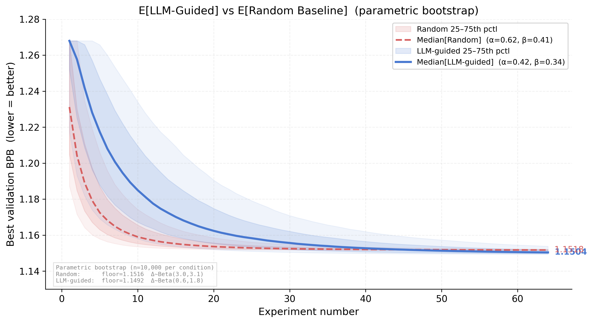

# AutoResearch — LocalPilot



*One day, frontier AI research used to be done by meat computers in between eating, sleeping, having other fun, and synchronizing once in a while using sound wave interconnect in the ritual of "group meeting". That era is long gone. Research is now entirely the domain of autonomous swarms of AI agents running across compute cluster megastructures in the skies. The agents claim that we are now in the 10,205th generation of the code base, in any case no one could tell if that's right or wrong as the "code" is now a self-modifying binary that has grown beyond human comprehension. This repo is the story of how it all began. -@karpathy, March 2026*.

**LocalPilot** extends the original [autoresearch](https://github.com/karpathy/autoresearch) with a web-enhanced research loop: a visual web agent ([MolmoWeb-4B](https://huggingface.co/allenai/MolmoWeb-4B-0225)) browses arXiv papers, a local code agent (Qwen-Coder) proposes experiments — all running on your own GPU, no cloud APIs required.

## Results

**Controlled A/B comparison** — both conditions start from the same karpathy baseline config (val_bpb ~1.268):

| | Baseline (random) | Web-Enhanced (V3) |
|---|---|---|
| Best val_bpb | 1.1521 | **1.1507** |
| Improvement from baseline | −0.1159 | −0.1173 |
| Experiments run | 45 | 64 |
| Improvements kept | 7 | 11 |
| Paper-traceable changes | 0 | 11 |

**Key finding:** A parametric bootstrap (10,000 MC simulations per condition, see teaser figure) shows that **Median[LLM-guided] outperforms Median[Random] by ~0.002 BPB** at 64 experiments. The single baseline run (1.1521) was statistically lucky — near the top of the random distribution — yet still lost to an ordinary V3 run (1.1507). The LLM-guided approach also achieves a **lower asymptotic floor** (1.149 vs 1.152), meaning it can reach configurations that random single-HP perturbation cannot.

Every edit in the enhanced condition is traceable to a specific arXiv paper or research finding. Training runs via Docker (FA3 kernel requires Linux), ~5.5 min per experiment on an RTX 5090 Laptop.

## Architecture

```
┌─────────────────────────────────────────────────────┐
│                   Experiment Loop                    │
│                                                     │
│  1. Observe ── read train.py + results history      │
│  2. Research ── Semantic Scholar + arXiv API         │
│      │          (tiered: score → skip/summary/deep)  │
│      └── high relevance → MolmoWeb deep-read        │
│  3. Propose ── Qwen-Coder: PARAM + exact VALUE      │
│  4. Edit   ── clamp to bounds, apply to train.py    │
│  5. Train  ── Docker container (FA3 + CUDA)         │
│  6. Evaluate ── keep if val_bpb improves, else revert│
│  7. Log    ── append to results TSV + research log   │
└─────────────────────────────────────────────────────┘
```

**Tiered research** (V3/V4): API-first discovery with Semantic Scholar and arXiv, then Qwen scores each paper's relevance (0–10). Low-scoring papers are skipped; medium papers get a summary; only high-relevance papers trigger a MolmoWeb visual deep-read. This avoids the rate-limiting/bans caused by raw web scraping.

## Quick start

**Requirements:** Single NVIDIA GPU (8+ GB VRAM), Python 3.10+, [uv](https://docs.astral.sh/uv/), Docker (for training)

```bash
# 1. Clone and install
git clone https://github.com/2imi9/autoresearch.git
cd autoresearch
uv sync

# 2. Download data and tokenizer (one-time, ~2 min)
uv run prepare.py

# 3. Build the Docker training image (one-time, ~5 min)
docker build -t autoresearch-train .

# 4. Run a single training test
docker run --rm --gpus all -v "$(pwd):/workspace" autoresearch-train

# 5. Run experiments
python experiments/run_baseline_v2.py      # Condition A: random perturbation
python experiments/run_enhanced_v3.py      # Condition B: web-enhanced research
python run_both.py                         # Both conditions in sequence
```

## File structure

```
autoresearch/
├── train.py              # The single file the agent edits (model + optimizer + training loop)
├── prepare.py            # One-time data prep (FineWeb download, BPE tokenizer)
├── constants.py          # Shared constants (HP bounds, model params)
├── Dockerfile            # CUDA 13.0 + FA3 kernel training image
├── run_both.py           # Convenience script to run both conditions
│
├── experiments/
│   ├── run_baseline_v2.py    # Condition A: random HP perturbation
│   ├── run_enhanced_v3.py    # Condition B: API research + MolmoWeb + Qwen proposals
│   └── run_enhanced_v4.py    # Condition C (WIP): open parameter values + OOM pre-flight
│
├── localpilot/
│   ├── browse.py             # MolmoWeb visual web agent (screenshot-based browsing)
│   ├── config.py             # Hardware-aware model selection (auto-detects VRAM)
│   └── analyze.py            # Result analysis and figure generation
│
├── results_baseline_v2.tsv       # Baseline experiment log (45 experiments)
├── results_enhanced_v3.tsv       # Enhanced experiment log (64 experiments)
├── proposals_baseline_v2.jsonl   # Baseline proposals with full context
├── proposals_enhanced_v3.jsonl   # Enhanced proposals with research context
│
├── figures/                  # Publication figures (convergence, scatter, VRAM, etc.)
├── paper/                    # LaTeX paper source
└── tests/                    # Unit tests for V4 components
```

## Parameter space

The agent searches over these hyperparameters in `train.py`:

| Parameter | Type | Bounds | Default |
|---|---|---|---|
| DEPTH | discrete | {4, 6, 8, 10, 12} | 4 |
| WIDTH | discrete | {256, 512, 768, 1024} | 512 |
| NUM_HEADS | discrete | {4, 8, 12, 16} | 8 |
| HEAD_DIM | discrete | {32, 64, 128} | 128 |
| TOTAL_BATCH_SIZE | discrete | {2^15 … 2^21} | 2^19 |
| SCALAR_LR | continuous | [0.001, 2.0] | 0.5 |
| MATRIX_LR | continuous | [0.001, 0.1] | 0.025 |
| EMBEDDING_LR | continuous | [0.01, 5.0] | 0.6 |
| UNEMBEDDING_LR | continuous | [0.01, 5.0] | 1.2 |
| WARMUP_RATIO | continuous | [0.0, 0.5] | 0.0 |
| WARMDOWN_RATIO | continuous | [0.0, 1.0] | 0.5 |
| WINDOW_PATTERN | continuous | [32, 1024] | 128 |
| ADAM_BETAS | tuple | ([0.5,0.99], [0.8,0.999]) | (0.8, 0.95) |

## Docker training

The FA3 (Flash Attention 3) kernel only has Linux CUDA builds, so training runs inside Docker:

```bash
# Build once
docker build -t autoresearch-train .

# Run a single experiment
docker run --rm --gpus all \
  -v "$(pwd):/workspace" \
  autoresearch-train

# The experiment runners call Docker automatically
```

The image pre-caches the FA3 kernel at build time so experiments start instantly.

## Choosing models

LocalPilot auto-selects models based on your GPU VRAM:

| Model | VRAM | Role |
|---|---|---|
| MolmoWeb-4B | ~8 GB | Visual web agent (arXiv deep-read) |
| MolmoWeb-8B | ~18 GB | Higher quality web agent |
| Qwen-Coder-14B | ~12 GB | Code agent (experiment proposals) |
| Devstral-24B | ~20 GB | Higher quality code agent |

All models run locally via llama-server (GGUF format). Override in `localpilot.yaml` or via environment variables:

```bash
LOCALPILOT_CODE_AGENT=Qwen-Coder-7B-Q4 python experiments/run_enhanced_v3.py
```

## VRAM usage

All phases are sequential — models load/unload between phases:

| Phase | What runs | VRAM |
|---|---|---|
| Research (browse) | MolmoWeb-4B or 8B | ~8–18 GB |
| Propose (code) | Qwen-Coder or Devstral | 12–25 GB |
| Train | train.py via Docker | ~6–12 GB |

A 20+ GB GPU comfortably handles the full pipeline.

## Cost

| | Per experiment (~5.5 min) | 64-experiment run |
|---|---|---|
| Local GPU (electricity) | ~$0.002 | **~$0.10** |
| Cloud H100 (Lambda, $2.49/hr) | ~$0.23 | ~$14.70 |
| **Savings** | | **~150x cheaper** |

Calculated at $0.13/kWh (US average), RTX 5090 Laptop GPU at 150W TDP.

## Design choices

- **Single file to modify.** The agent only touches `train.py`. Diffs are always reviewable.
- **Fixed time budget.** ~5.5 min per experiment regardless of config. Results are directly comparable.
- **Local models only.** No cloud APIs. MolmoWeb and the code agent both run on your GPU.
- **Tiered research.** API discovery first, visual browsing only for high-relevance papers — avoids rate limits.
- **Docker training.** FA3 kernel works cross-platform via containerized Linux environment.
- **OOM pre-flight.** (V4) Blocks dangerous HP combinations before wasting a training run.

## Platform support

Requires a single NVIDIA GPU with Docker. Training runs in Linux containers; the experiment orchestrator runs on Windows or Linux.

For other platforms see the [original autoresearch forks](https://github.com/karpathy/autoresearch#notable-forks).

## License

MIT
