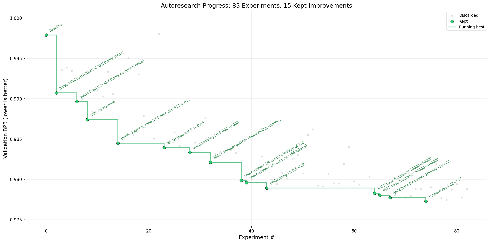

# LocalPilot



*One day, frontier AI research used to be done by meat computers in between eating, sleeping, having other fun, and synchronizing once in a while using sound wave interconnect in the ritual of "group meeting". That era is long gone. Research is now entirely the domain of autonomous swarms of AI agents running across compute cluster megastructures in the skies. The agents claim that we are now in the 10,205th generation of the code base, in any case no one could tell if that's right or wrong as the "code" is now a self-modifying binary that has grown beyond human comprehension. This repo is the story of how it all began. -@karpathy, March 2026*.

**LocalPilot** extends the original [autoresearch](https://github.com/karpathy/autoresearch) with a web-enhanced research loop: a visual web agent (MolmoWeb-4B or MolmoWeb-8B) browses recent arXiv papers and a local code agent (Devstral / Qwen-Coder) generates experiment scripts — all running on your own GPU, no cloud APIs required.

## Results

Comparing 78 baseline experiments vs 53 web-enhanced experiments, both starting from the same config:

| | Baseline | Web-Enhanced |
|---|---|---|
| Best val_bpb | 1.122049 | **1.118972** |
| Total improvement | −0.000489 | **−0.003566** |
| Experiments used | 78 | **53 (−32%)** |
| Final streak | 0/10 plateau | **0/33 plateau at better value** |

Web-enhanced search achieves **7.3x more improvement** in fewer experiments. All 5 improvements are traceable to specific arXiv papers (2023–2026).

## How it works

The repo builds on the original three core files:

- **`prepare.py`** — one-time data prep (downloads FineWeb, trains BPE tokenizer)
- **`train.py`** — the single file the agent edits (model, optimizer, training loop)
- **`program.md`** — agent instructions

LocalPilot adds:

- **`localpilot/browse.py`** — MolmoWeb-4B/8B visual web agent for arXiv paper retrieval
- **`experiments/run_baseline.py`** — greedy hill-climbing runner (Condition A baseline)
- **`experiments/run_web.py`** — paper-grounded experiment runner (Condition B enhanced)
- **`localpilot/config.py`** — hardware-aware model selection (auto-detects VRAM, picks best local model)
- **`localpilot/analyze.py`** — result analysis and figure generation
- **`localpilot.yaml`** — optional config overrides

## Quick start

**Requirements:** Single NVIDIA GPU (8+ GB VRAM), Python 3.10+, [uv](https://docs.astral.sh/uv/)

```bash
# 1. Clone and install
git clone https://github.com/2imi9/LocalPilot.git
cd LocalPilot
uv sync

# 2. Download data and tokenizer (one-time, ~2 min)
uv run prepare.py

# 3. Check your hardware and recommended models
python -m localpilot.config --show

# 4. Download models for your GPU
python -m localpilot.config --download-web-agent    # MolmoWeb-4B (~8 GB) or MolmoWeb-8B (~18 GB)
python -m localpilot.config --download-code-agent   # auto-selected based on VRAM

# 5. Run a single training test (~2 min)
uv run train.py
```

## Choosing your models

LocalPilot auto-selects models based on your GPU VRAM:

```bash
python -m localpilot.config --models
```

```
  Available Web Agent Models:
  Key            VRAM   Description
  MolmoWeb-4B     8 GB  4B visual web agent — fits most GPUs        <- RTX 3080 and up
  MolmoWeb-8B    18 GB  8B visual web agent — state-of-the-art      <- RTX 4090 / 5090 *

  * MolmoWeb-8B is based on Qwen3-8B + SigLIP2, surpasses GPT-4o SoM agents (arXiv:2601.10611)

  Available Code Agent Models:
  Key                   VRAM   SWE-bench  Description
  [ ] Devstral-24B-Q8   25 GB     68.0%   Maximum quality
  [Y] Devstral-24B-Q6   20 GB     67.5%   High quality          <- RTX 4090 / 5090
  [Y] Devstral-24B-Q4   14 GB     66.0%   Good quality          <- RTX 3090 / 4080
  [Y] Qwen-Coder-14B-Q6 12 GB     37.0%   Solid coder           <- RTX 3080
  [Y] Qwen-Coder-7B-Q4   5 GB     33.0%   Lightweight           <- RTX 3060
  [Y] Qwen-Coder-7B-CPU  0 GB     33.0%   CPU only (any machine)
```

Override in `localpilot.yaml`:
```yaml
web_agent: MolmoWeb-8B
code_agent: Devstral-24B-Q4
```

Or via environment variable:
```bash
LOCALPILOT_CODE_AGENT=Qwen-Coder-7B-Q4 python experiments/run_web.py
```

## Running experiments

**Baseline (random greedy search):**
```bash
python experiments/run_baseline.py
```

**Web-enhanced (paper-grounded search):**
```bash
python experiments/run_web.py
```

**Analyze results:**
```bash
python -m localpilot.analyze
# Outputs: figures/fig1_trajectory.png, table1_summary.tsv
```

## Starting a new project

```powershell
# Creates a fresh LocalPilot project in a new directory
.\scripts\new_project.ps1 -Name "MyResearch" -Dest "C:\Projects"
```

## VRAM usage (sequential, never simultaneous)

| Phase | What runs | VRAM |
|---|---|---|
| Browse arXiv | MolmoWeb-4B or MolmoWeb-8B | ~8–18 GB |
| Generate experiment script | Code agent (Devstral/Qwen) | 14–25 GB |
| Training | train.py | ~6 GB |

All three phases are sequential — the models load and unload between phases, so a 20 GB GPU comfortably handles Devstral Q6 + MolmoWeb-4B + training without overlap. A 24 GB GPU (e.g. RTX 5090) can also run MolmoWeb-8B for higher web agent quality.

## Design choices

- **Single file to modify.** The agent only touches `train.py`. Diffs are always reviewable.
- **Fixed time budget.** ~2 min per experiment regardless of model size or batch size. Experiments are directly comparable.
- **Local models only.** No cloud APIs. MolmoWeb-4B/8B and the code agent both run on your GPU.
- **Hardware-aware.** `localpilot/config.py` detects your VRAM and picks the best model that fits — MolmoWeb-8B on ≥18 GB, MolmoWeb-4B on ≥8 GB.

## Platform support

Requires a single NVIDIA GPU. For other platforms see the [original autoresearch forks](https://github.com/karpathy/autoresearch#notable-forks).

## License

MIT
